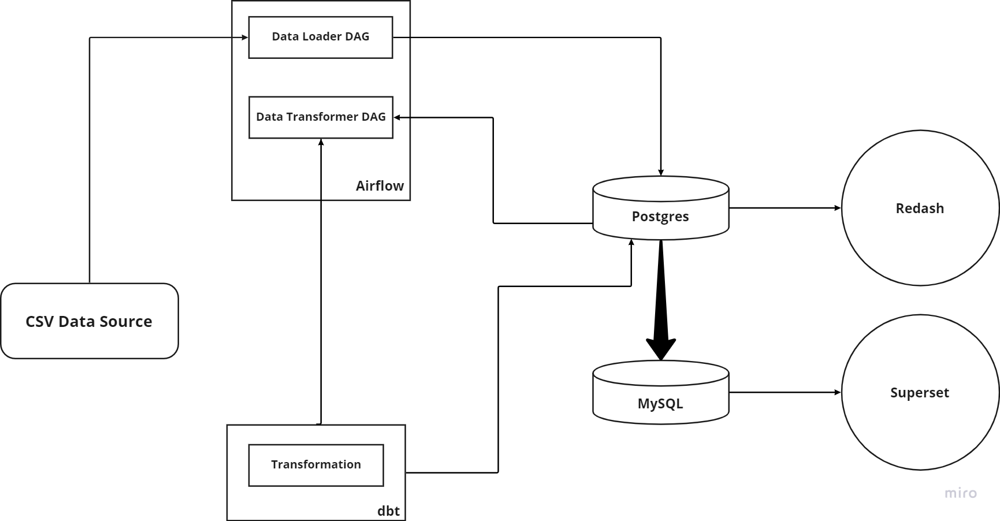

# Traffic Flow ELT Migration

A data pipeline for Extracting, Loading and Transforming traffic flow data

<p align="center">
  <h3 align="center">Data Engineering Traffic Flow Drone Data</h3>

  <p align="center">
    A fully dockerized ELT pipeline using PostgreSQL, dbt, Apache Airflow, and Redash.
    <br />
    <a href="#about-the-project"><strong>Explore the docs »</strong></a>
    <br />
    <br />
  </p>
</p>

<!-- TABLE OF CONTENTS -->
<details open="open">
  <summary>Table of Contents</summary>
  <ol>
    <li>
      <a href="#about-the-project">About The Project</a>
      <ul>
        <li><a href="#built-with">Built With</a></li>
      </ul>
    </li>
    <li>
      <a href="#getting-started">Getting Started</a>
      <ul>
        <li><a href="#prerequisites">Prerequisites</a></li>
        <li><a href="#installation">Installation</a></li>
      </ul>
    </li>
    <li><a href="#contributing">Contributing</a></li>
    <li><a href="#license">License</a></li>
    <li><a href="#contact">Contact</a></li>
    <li><a href="#acknowledgements">Acknowledgements</a></li>
  </ol>
</details>

<!-- ABOUT THE PROJECT -->

## About The Project



A completely dockerized ELT pipeline with PostgreSQL for data storage, Airflow for automation and orchestration, DBT for data transformation, and a Redash dashboard connected to the data warehouse.

### Built With

Tech Stack used in this project

-   [PostgreSQL](https://dev.PostgreSQL.com/doc/)
-   [Apache Airflow](https://airflow.apache.org/docs/apache-airflow/stable/)
-   [dbt](https://docs.getdbt.com/)
-   [Redash](https://redash.io/help/)

<!-- GETTING STARTED -->

## Getting Started

### Prerequisites

Make sure you have docker installed on local machine.

-   Docker
-   Docker Compose

### Installation

1. Clone the repo
    ```sh
    git clone https://github.com/nahomfix/traffic-flow-ELT.git
    ```
2. Navigate to the folder

    ```sh
    cd traffic-flow-ELT
    ```

3. Build an airflow image

    ```sh
    docker build . --tag extending_airflow:latest
    ```

4. Run the following command once for first time initialization

    ```sh
     docker-compose up airflow-init
    ```

5. Run
    ```sh
     docker-compose up
    ```
6. Open Airflow web browser
    ```JS
    Navigate to `http://localhost:8000/` on the browser
    activate and trigger load_dag
    activate and trigger transform_dag
    ```
7. Access redash dashboard
    ```JS
    Navigate to `http://localhost:5000/` on the browser
    ```

<!-- CONTRIBUTING -->

## Contributing

Contributions are what make the open source community such an amazing place to learn, inspire, and create. Any contributions you make are **greatly appreciated**.

1. Fork the Project
2. Create your Feature Branch (`git checkout -b feature/AmazingFeature`)
3. Commit your Changes (`git commit -m 'Add some AmazingFeature'`)
4. Push to the Branch (`git push origin feature/AmazingFeature`)
5. Open a Pull Request

<!-- LICENSE -->

## License

Distributed under the MIT License. See `LICENSE` for more information.

<!-- CONTACT -->

## Contact

Nahom Bekele - nahom.fix@gmail.com

<!-- ACKNOWLEDGEMENTS -->

## Acknowledgements

-   [10 Academy](https://www.10academy.org/)
